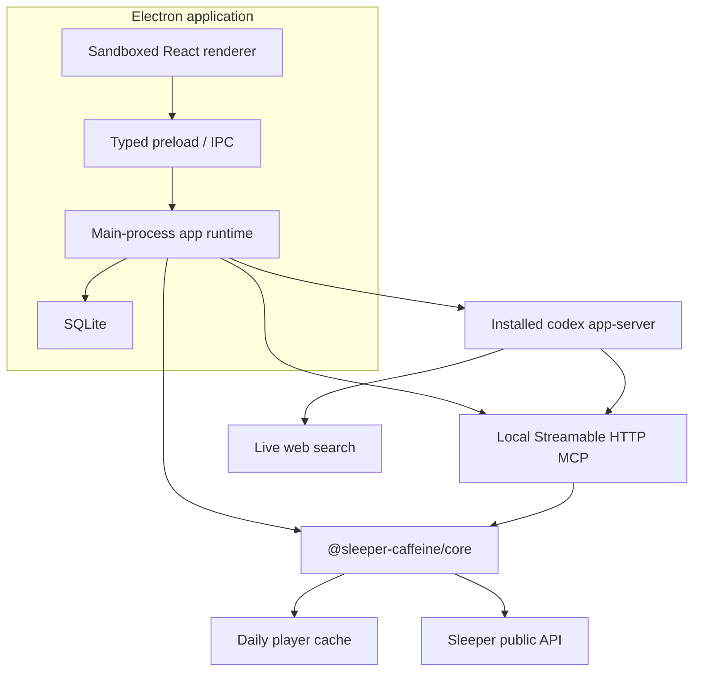

# Sleeper Caffeine Project Plan

> Status: the v1 vertical slice is implemented. This document records the architecture, product boundaries, completed work, and the remaining path to a public GitHub release.

## 1. Product goal

Build an open-source desktop fantasy football front office that combines:

- Deterministic, read-only league state from Sleeper.
- A reusable Sleeper MCP server.
- Persistent local snapshots and recommendation history.
- Codex-managed ChatGPT login, threads, structured reports, and live web research.
- A polished multi-league interface that feels useful without requiring AI.

The first release is read-only. It does not change lineups, submit waivers, send or accept trades, or automate a signed-in Sleeper browser.

## 2. Decisions

| Area                     | Decision                                                                                                        |
| ------------------------ | --------------------------------------------------------------------------------------------------------------- |
| Distribution             | Open-source GitHub project from day one.                                                                        |
| Product name             | Sleeper Caffeine.                                                                                               |
| Workspace                | pnpm monorepo.                                                                                                  |
| Desktop                  | Electron, React, TypeScript, electron-vite.                                                                     |
| MCP                      | Keep the existing adapter independently usable. Add an app-managed Streamable HTTP transport.                   |
| Codex binary             | Discover an installed version; do not bundle one.                                                               |
| OpenAI authentication    | ChatGPT login only in v1, managed by `codex app-server`.                                                        |
| Codex isolation          | Dedicated app-owned `CODEX_HOME`.                                                                               |
| Safety                   | Read-only sandbox, approval policy `never`, shell disabled, no write tools.                                     |
| Web                      | Live web search is a core v1 feature. Reports distinguish discovery/search from the actual cited source.        |
| League model             | Multiple saved leagues with one active league. Persist league ID, roster ID, and user ID.                       |
| AI surfaces              | Structured cards plus a persistent conversational analyst.                                                      |
| Active v1 reports        | Team analysis, trade suggestions, and draft candidates.                                                         |
| Deferred weekly surfaces | Waiver wire and start/sit activate when regular-season data is useful.                                          |
| Draft                    | Read-only live board and on-demand candidate report; no automated drafting.                                     |
| Refresh                  | Refresh Sleeper immediately, write SQLite, invalidate reports, and spend no AI turn.                            |
| Scheduling               | Refresh on launch; later refreshes are manual in v1.                                                            |
| Retention                | Keep snapshots, reports, and recommendation history indefinitely. Hide a destructive clear control in Settings. |
| Visuals                  | Player headshots and Sleeper avatars where available; strong monogram fallbacks.                                |
| Future writes            | Separate opt-in design with confirmations; never an implicit extension of v1.                                   |

## 3. Architecture



### Why the UI does not call MCP

MCP is an agent-facing adapter, not the desktop application's internal service boundary. The Electron main process and the MCP bridge both call `sleeper-core`, which prevents protocol overhead and keeps one implementation of caching, joins, validation, retries, and league semantics.

### Why Codex app-server

A long-lived app-server provides managed ChatGPT authentication, native threads, streaming turn events, structured output schemas, MCP configuration, and live search. The desktop owns fantasy data and presentation; Codex owns OpenAI identity and model orchestration.

## 4. Package responsibilities

```text
apps/desktop
  Electron lifecycle, SQLite, onboarding, dashboard, reports, chat, settings

packages/sleeper-core
  Sleeper HTTP client, Zod schemas, cache, identity resolution, fantasy joins

packages/sleeper-mcp
  MCP registrations, stdio entry point, local Streamable HTTP bridge

packages/ipc-contract
  Shared renderer/main types, runtime schemas, report JSON schema, channel names

packages/codex-runtime
  Binary discovery, JSONL JSON-RPC, app-server lifecycle, OAuth, turns
```

## 5. Data model

SQLite tables:

| Table              | Purpose                                                                   |
| ------------------ | ------------------------------------------------------------------------- |
| `leagues`          | Saved league/team identity, active league, latest materialized dashboard. |
| `league_snapshots` | Immutable dashboard and compact raw-source snapshots.                     |
| `ai_reports`       | Structured report history and invalidation state.                         |
| `codex_threads`    | Persistent thread ID by league and purpose.                               |
| `chat_messages`    | Local conversational analyst history.                                     |

The daily full player map remains a file cache rather than being copied into every database snapshot.

## 6. Codex runtime profile

Startup configuration:

```text
CODEX_HOME=<app user data>/codex-home
codex app-server --listen stdio:// --strict-config
  --disable shell_tool
  -c web_search="live"
  -c mcp_servers.sleeper_caffeine.url="http://127.0.0.1:<port>/mcp"
  -c mcp_servers.sleeper_caffeine.required=true
```

Each thread starts with:

- `approvalPolicy: "never"`
- `sandbox: "read-only"`
- Read-only fantasy analyst instructions.
- A requirement to call Sleeper MCP before league-specific claims.
- A requirement to source current football claims from actual pages found through web search.

Each turn also applies a read-only sandbox policy with network access so live research is available. Command and file-change approval requests are declined defensively even though shell access is disabled.

Thread strategy:

```text
league / report:team_analysis
league / report:trade_suggestions
league / report:draft_candidates
league / conversation
```

Structured report turns use an output JSON schema and validate the final JSON again with Zod before persistence.

## 7. Sleeper data behavior

The fixed upstream is `https://api.sleeper.app/v1`. Supported reads include leagues, users, rosters, matchups, transactions, drafts, picks, traded picks, brackets, NFL state, trending players, and the NFL player directory.

The player directory:

- Is fetched at most daily during normal use.
- Is validated before replacement.
- Uses atomic disk writes.
- Coalesces concurrent refreshes.
- Falls back to a valid stale copy with an explicit warning.
- Is never returned wholesale to Codex.

“Available player” means absent from every current roster. It does not imply waiver clearance, lock status, or eligibility.

## 8. User flows

### League onboarding

1. Paste a Sleeper league URL or numeric league ID.
2. Fetch league, users, and rosters.
3. Present every owned roster with team/avatar/record context.
4. Select “my team.”
5. Persist league ID, roster ID, and user ID.
6. Materialize the first dashboard snapshot.

### Refresh

1. Read current Sleeper league state immediately.
2. Reuse or refresh the player cache.
3. Build a compact dashboard and draft view.
4. Append a snapshot.
5. Mark existing reports stale.
6. Do not invoke Codex.

### Generate a report

1. Require a current dashboard and ChatGPT login.
2. Resume the report-specific Codex thread or create it.
3. Tell Codex the league/user/roster identifiers.
4. Require the relevant Sleeper MCP tools.
5. Allow live web search for current context.
6. Stream progress into the UI.
7. Validate the final structured result.
8. Persist the report against the snapshot timestamp.

### Conversational analyst

Chat uses a league-specific persistent thread and local message history. Every prompt carries the active league identity; base instructions still require fresh Sleeper tool results for league-specific claims.

## 9. Security boundaries

- No Sleeper credentials are requested or stored.
- OpenAI tokens remain inside the dedicated Codex home.
- The renderer receives account email/plan/status only, never tokens.
- Inherited `OPENAI_API_KEY`, `CODEX_API_KEY`, and `CODEX_ACCESS_TOKEN` are removed from the child environment.
- The renderer has context isolation, sandboxing, no Node integration, and a narrow preload API.
- External links must be HTTPS and open in the system browser.
- The local MCP listens on loopback only.
- The initial local MCP has no bearer token by design; the data is the same public read-only fantasy data shown in the app.
- Content Security Policy restricts scripts, connections, fonts, and image hosts.
- Any future authenticated browser automation requires a new threat model and design review.

## 10. Completed implementation

- [x] Commit the original standalone MCP as the baseline (`a5ed90d`).
- [x] Convert to a pnpm monorepo.
- [x] Extract `sleeper-core` and preserve the standalone MCP CLI.
- [x] Add a session-aware Streamable HTTP MCP bridge.
- [x] Add typed IPC contracts and constrained report schemas.
- [x] Add installed-Codex discovery and app-server JSONL supervision.
- [x] Add dedicated-home ChatGPT login flow.
- [x] Add live web search and read-only runtime configuration.
- [x] Add SQLite migrations, snapshots, reports, threads, and chat history.
- [x] Add multi-league onboarding and switching.
- [x] Add dashboard, roster, report, trade, draft, weekly placeholders, and settings.
- [x] Add player/avatar imagery with fallbacks.
- [x] Add per-card generation and stale-report handling.
- [x] Add deterministic manual refresh and launch refresh.
- [x] Add unit, MCP contract, live Sleeper, and Codex handshake coverage.
- [x] Add open-source documentation and CI.

## 11. Release checklist

- [x] Add application icon assets for macOS, Windows, and Linux.
- [ ] Produce and manually inspect unsigned packages on all target platforms.
- [ ] Add release signing/notarization when maintainership credentials exist.
- [ ] Add screenshots/GIFs to the GitHub README.
- [ ] Validate ChatGPT browser login from a clean packaged application.
- [ ] Validate a complete structured AI report after login.
- [ ] Add database schema-version migrations before the first breaking schema change.
- [ ] Publish the repository and enable CI branch protection.

## 12. Later phases

### Regular season

- Waiver candidate ranking using real availability, usage, injury, and role signals.
- Start/sit comparisons with matchup, weather, injury, and flex-rule context.
- Recommendation outcomes and weekly retrospectives.

### Draft improvements

- Optional short-interval board polling while the draft room is open.
- Pick-trade-aware upcoming slots.
- Tier and positional-run detection.
- Candidate regeneration that incorporates the most recent pick without refreshing unrelated reports.

### Evidence adapters

- Deterministic projection/ranking ingestion where terms and licensing permit it.
- Player identity reconciliation across providers.
- Source freshness and contradiction surfacing.
- The Athletic links where discoverable, without bypassing authentication or paywalls.

### Write automation

Out of scope until a separate proposal defines authentication, browser isolation, confirmations, audit logs, reversibility, failure handling, and an explicit per-action opt-in. Read-only v1 code must not quietly grow write paths.
