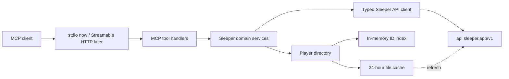

# Sleeper MCP Project Plan

> Implementation status (July 13, 2026): local read-only v0.1 phases 0–4 are complete. Streamable HTTP/ChatGPT deployment and browser automation remain the explicitly optional, deferred phases described below.

## 1. Goal

Build a local, read-only TypeScript MCP server that turns Sleeper's public NFL API into compact, model-friendly fantasy-football tools.

The first release will:

- Resolve a Sleeper username to its stable user ID.
- Read league settings, users, rosters, matchups, transactions, drafts, and traded picks.
- Cache Sleeper's large NFL player-ID map and join player names/positions into results.
- Expose a small set of typed MCP tools over local `stdio`.
- Keep Sleeper/domain code independent from MCP transport so Streamable HTTP, a ChatGPT app, and carefully controlled browser automation can be added later.

The server will not change lineups, submit waivers, propose/accept trades, or require Sleeper credentials. Sleeper's documented API is public and read-only.

## 2. Key decisions

| Area | Decision | Reason |
| --- | --- | --- |
| Language/runtime | Strict TypeScript on Node.js, ESM, npm | Good fit for the official MCP TypeScript SDK and the current local environment. |
| MCP SDK | Pin the stable `@modelcontextprotocol/sdk` v1 release line | The official repository's v2 line is still pre-release as of July 2026; v1 remains the production recommendation. Revisit after stable v2 ships. |
| Initial transport | `stdio` | Simplest and safest local integration; no port, TLS, or server authentication required. |
| Future transport | Stateless Streamable HTTP at `/mcp` | Current MCP/OpenAI recommendation for remote servers. It can be added without changing domain services. |
| Validation | Zod at all external boundaries | Sleeper responses are loosely documented and MCP tool inputs/outputs need explicit schemas. |
| Player cache | Persistent JSON file plus an in-memory index, 24-hour freshness window | Simple and sufficient for a single-user local server; avoids downloading the roughly 5 MB player map for every call. |
| Test runner | Vitest with recorded, sanitized Sleeper fixtures | Fast TypeScript tests without depending on live API availability. |
| Scope | NFL and read-only only | Matches Sleeper's best-documented fantasy API and keeps the first version safe. |

Do not use the in-development split v2 packages (`@modelcontextprotocol/server`, etc.) in the MVP. Wrap SDK-specific registration and transport code in `src/mcp/` so a later v2 migration is localized.

## 3. Architecture



Important boundaries:

- MCP handlers validate inputs, invoke one domain operation, and format compact structured results.
- Domain services own joins and fantasy-specific derivations. They do not know about MCP transports.
- The Sleeper client owns HTTP behavior, response validation, timeouts, retries, and request limits.
- The player directory is the only code allowed to call `/players/nfl`.
- Any future browser integration must implement a separate interface/process; it must never leak cookies or write behavior into the public API client.

## 4. Proposed repository layout

```text
.
├── src/
│   ├── index.ts                    # process entry point
│   ├── config.ts                   # env/config parsing
│   ├── errors.ts                   # stable internal/tool error codes
│   ├── sleeper/
│   │   ├── client.ts               # fixed-base-URL HTTP client
│   │   ├── endpoints.ts            # endpoint methods
│   │   ├── schemas.ts              # tolerant Zod response schemas
│   │   └── types.ts
│   ├── players/
│   │   ├── cache.ts                # disk persistence and freshness policy
│   │   ├── directory.ts            # in-memory ID lookup/search
│   │   └── schemas.ts
│   ├── domain/
│   │   ├── identity.ts
│   │   ├── team-snapshot.ts
│   │   ├── available-players.ts
│   │   ├── matchup-context.ts
│   │   ├── trade-context.ts
│   │   └── league-history.ts
│   └── mcp/
│       ├── create-server.ts
│       ├── response.ts             # common result envelope
│       ├── tools/                  # one registration module per tool
│       └── transports/
│           ├── stdio.ts
│           └── http.ts             # added in a later phase
├── scripts/
│   └── refresh-player-cache.ts
├── test/
│   ├── fixtures/sleeper/           # sanitized API responses
│   ├── unit/
│   ├── contract/
│   └── live/                       # opt-in read-only smoke tests
├── .cache/                         # ignored runtime data
├── .env.example
├── .gitignore
├── package.json
├── tsconfig.json
├── README.md
└── PLAN.md
```

## 5. Sleeper data layer

Use `https://api.sleeper.app/v1` as a fixed base URL. Do not accept an arbitrary upstream URL from tool input; tests can inject a mock HTTP implementation instead.

### Endpoint coverage

| Sleeper endpoint | Use |
| --- | --- |
| `/user/{username_or_user_id}` | Resolve identity and retain the stable `user_id`. |
| `/state/nfl` | Supply the default season/week when a tool input omits them. |
| `/league/{league_id}` | League format, roster slots, scoring, season, and history link. |
| `/league/{league_id}/users` | Owner/team display metadata. |
| `/league/{league_id}/rosters` | Players, starters, reserve/taxi slots, record, and waiver state. |
| `/league/{league_id}/matchups/{week}` | Weekly opponent, starters, bench, and points. |
| `/league/{league_id}/transactions/{week}` | Adds, drops, waivers, and trades for context. |
| `/league/{league_id}/traded_picks` | Current ownership of future picks. |
| `/league/{league_id}/drafts` | Draft metadata; remember a dynasty league can have multiple drafts. |
| `/draft/{draft_id}/picks` | Draft history when requested by trade/history tools. |
| `/players/nfl` | Player-ID directory; access only through the cache. |
| `/players/nfl/trending/{add|drop}` | Optional ranking signal for available players. |
| `/league/{league_id}/{winners_bracket|losers_bracket}` | Optional completed-season/playoff history. |

Sleeper has no documented “available players in this league” endpoint. Availability will mean **not present on any current league roster**. The output must call this `roster_availability` and must not imply that the player can currently clear waivers, is unlocked, or is eligible for a particular roster slot.

### HTTP behavior

- Set a short connect/request timeout (target: 10 seconds total).
- Retry only `429`, `502`, `503`, `504`, and transient network failures, with bounded exponential backoff and jitter; never retry ordinary `4xx` responses.
- Keep concurrency bounded while fetching independent league endpoints in parallel.
- Stay comfortably below Sleeper's documented general guideline of 1,000 requests/minute.
- Parse error bodies defensively and return stable internal error codes such as `SLEEPER_NOT_FOUND`, `SLEEPER_RATE_LIMITED`, `SLEEPER_UNAVAILABLE`, and `INVALID_SLEEPER_RESPONSE`.
- Treat ID types deliberately: league/user/player IDs are strings; roster IDs are numbers. Preserve team-defense player IDs such as `CAR`.
- Make response schemas tolerant of additive/undocumented fields while validating fields used by domain logic.

## 6. Player directory and cache

Cache location defaults to `.cache/sleeper/players-nfl.json` and can be overridden with `SLEEPER_CACHE_DIR`.

Cache record:

```ts
type PlayerCacheFile = {
  schemaVersion: 1;
  fetchedAt: string;
  source: "https://api.sleeper.app/v1/players/nfl";
  players: Record<string, SleeperPlayer>;
};
```

Required behavior:

1. On first need, load and validate the disk cache.
2. If it is less than 24 hours old, build the in-memory `Map<string, PlayerSummary>` and use it.
3. If missing or stale, perform one refresh shared by all concurrent callers (single-flight behavior).
4. Validate the entire new payload before replacing the old file.
5. Write to a temporary file and atomically rename it, so interruption cannot corrupt the last good cache.
6. If refresh fails but a valid stale cache exists, serve stale data and add a machine-readable warning with `fetched_at` and `age_seconds`.
7. If neither a fresh nor stale cache exists, fail clearly rather than returning unresolved IDs as if the result were complete.
8. Never return or log the full player map through MCP.

Keep only useful fields in model-facing joins: `player_id`, display name, position/fantasy positions, NFL team, status, injury status, depth-chart order, years of experience, and search rank. Preserve the raw validated cache on disk so additional fields can be adopted later without another download.

Provide `npm run cache:refresh` for explicit maintenance. Ordinary tool calls refresh automatically when needed, so cache refresh is not an MCP tool.

## 7. MCP tool contracts

Every tool is read-only and should declare the equivalent of `readOnlyHint: true`, `destructiveHint: false`, and `openWorldHint: true`. Inputs and structured outputs get explicit Zod/JSON schemas. Results use a common envelope:

```ts
type ToolEnvelope<T> = {
  as_of: string;
  source: "sleeper";
  cache?: {
    players_fetched_at: string;
    players_stale: boolean;
  };
  warnings: Array<{ code: string; message: string }>;
  data: T;
};
```

Return this as structured content plus a very short text summary for clients that do not consume structured results well. Omit bulky raw upstream objects and cap lists.

### 7.1 `get_team_snapshot`

Input:

- `league_id: string` (required)
- `username_or_user_id: string` (required initially; a configured default can come later)
- `week?: number` (defaults from `/state/nfl`)

Output:

- League identity, season/status, team count, scoring settings, and ordered roster positions.
- Stable user ID, roster ID, team/display name, record, waiver position/FAAB fields when present.
- Joined starters, bench, reserve, taxi, and all players.
- Current matchup/opponent when one exists.
- Future pick inventory summary.

Identity resolution matches `owner_id`, and also handles documented/observed co-owner fields when present. A missing team is a clear error rather than a guess.

### 7.2 `get_available_players`

Input:

- `league_id: string` (required)
- `positions?: string[]`
- `query?: string`
- `include_inactive?: boolean` (default `false`)
- `sort?: "trending" | "search_rank" | "name"` (default `trending`)
- `limit?: number` (default `30`, maximum `100`)

Output:

- Compact joined player summaries not present on any roster.
- `roster_availability: true` on each result.
- Trending add count/lookback when requested and available.
- Filters and sort actually applied.

This tool does not invent projections. Sleeper search rank and trending adds are ranking signals, not start/sit or waiver recommendations.

### 7.3 `get_matchup_context`

Input:

- `league_id: string`
- `username_or_user_id: string`
- `week?: number`

Output:

- Both teams, records, ordered starters, bench, reserve/taxi, current points, and league scoring/slot context.
- Missing matchup/opponent represented explicitly (bye, pre-schedule, or unmatched state).
- No claim that Sleeper data alone includes current news, weather, projections, or optimal lineup advice.

Use “context,” not “analysis,” in the tool name: the server assembles authoritative facts; the calling model performs the interpretation.

### 7.4 `get_trade_context`

Input:

- `league_id: string`
- `username_or_user_id: string`
- `transaction_weeks?: number[]` (optional and capped)

Output:

- User's roster and future pick inventory.
- Compact summaries for every other roster/manager.
- Current ownership of traded picks, preserving original and current owner IDs.
- Requested recent completed/pending/failed trade records.
- Draft metadata and optional summarized pick history, fetched only when needed.

### 7.5 `get_league_history`

Input:

- `league_id: string`
- `max_seasons?: number` (default `5`, maximum `10`)

Output:

- Follow the `previous_league_id` chain with cycle detection.
- Per-season league settings summary, teams/records, and playoff result when obtainable.
- Explicit partial-result warnings when an older linked league no longer resolves.

This is the highest-call-count tool, so execute it sequentially or with conservative bounded concurrency and return compact season summaries.

## 8. Implementation phases

### Phase 0 — Scaffold and lock contracts

- Add `package.json`, strict ESM `tsconfig.json`, Vitest, lint/format configuration, `.gitignore`, and `.env.example`.
- Pin a stable v1 MCP SDK version and Zod rather than using floating `latest` ranges.
- Add scripts: `dev`, `build`, `start`, `typecheck`, `lint`, `test`, `test:live`, `inspect`, and `cache:refresh`.
- Define tool input/output schemas and common error/result envelopes before implementing handlers.

Exit criteria: clean install; build, typecheck, lint, and an empty test suite all pass.

### Phase 1 — Sleeper client and player cache

- Implement injected HTTP client, endpoint schemas, timeout/retry policy, and stable errors.
- Build persistent player cache, atomic writes, stale-if-error behavior, and in-memory index.
- Add sanitized fixtures and tests for fresh, stale, missing, corrupt, concurrent, and failed-refresh cases.

Exit criteria: `/players/nfl` is fetched at most once per 24-hour cache window during normal operation, including concurrent calls.

### Phase 2 — Domain joins

- Implement identity/roster resolution.
- Join users, rosters, players, matchups, picks, drafts, and transactions.
- Derive bench membership, roster availability, pick ownership, and league-history chains.
- Keep independent API calls parallel but bounded.

Exit criteria: domain functions pass fixture-based tests without importing MCP packages.

### Phase 3 — Local MCP server

- Register the five tools with precise descriptions, schemas, annotations, and compact responses.
- Add server-wide instructions stating that Sleeper data is read-only, availability is derived, and external news/weather are outside this server.
- Connect through `StdioServerTransport`; reserve stdout exclusively for MCP protocol messages and send diagnostics to stderr.
- Add graceful shutdown and safe error translation.

Exit criteria: MCP Inspector lists every tool and successfully calls each against fixtures and an opt-in live league.

### Phase 4 — Hardening and local release

- Add contract snapshots, malformed-input tests, upstream failure tests, and list-size limits.
- Document local client configuration, cache behavior, data provenance, privacy, and troubleshooting.
- Add structured debug logging with IDs and payloads minimized/redacted.
- Exercise a golden prompt set for team snapshot, matchup, waivers, trades, history, and negative/out-of-scope requests.

Exit criteria: `npm run build && npm run typecheck && npm run lint && npm test` passes; live smoke tests make no write attempts and no secrets are required.

### Phase 5 — Optional Streamable HTTP and ChatGPT integration

- Add a stateless Streamable HTTP transport at `/mcp`, keeping the same server factory and tools.
- Bind to `127.0.0.1` by default and add Host/DNS-rebinding protection for local HTTP use.
- For remote use, require HTTPS, request/rate limits, safe logs, and an explicit authentication decision even though Sleeper itself requires no auth. Do not expose a generic unauthenticated proxy.
- Test with MCP Inspector, then expose through a secure tunnel for ChatGPT developer-mode testing.
- Add a ChatGPT widget only if an interactive roster UI provides clear value; it is not required for tool-only MCP usage.

Exit criteria: the same contract tests pass over both `stdio` and Streamable HTTP, and ChatGPT can discover and invoke the read-only tools.

### Phase 6 — Future browser automation (separate design review)

Do not implement browser writes as an extension of a read-only tool. Before any automation is added:

- Separate public-API reads from authenticated browser sessions at the module and process boundaries.
- Threat-model credential/cookie storage, prompt injection from web content, CSRF, stale UI state, and duplicate actions.
- Make every lineup, waiver, or trade mutation a distinct, clearly named tool with write/destructive annotations.
- Require a preview plus explicit user confirmation immediately before consequential actions.
- Use idempotency guards where possible and read the resulting Sleeper page back after the action.
- Keep an audit record that distinguishes proposed, attempted, confirmed, failed, and externally changed states.

This phase is intentionally deferred until the read-only MCP is reliable.

## 9. Testing strategy

### Unit tests

- Zod parsing for realistic payload variants and undocumented/additive fields.
- User-to-roster and co-owner resolution.
- Starter/bench/reserve/taxi classification.
- Player ID joins, including missing IDs and NFL team defenses.
- Available-player subtraction and filters.
- Future-pick ownership and league-history cycle detection.
- Cache freshness, atomic replacement, stale fallback, and single-flight refresh.
- Retry classification and backoff with fake timers.

### MCP contract tests

- Tool discovery names, descriptions, input schemas, output schemas, and read-only annotations.
- Successful results match the common envelope.
- Limits prevent accidentally returning the full player directory or unbounded history.
- Upstream/cache errors become safe, actionable MCP errors with no local paths or raw payload dumps.

### Live tests

- Disabled unless `RUN_LIVE_TESTS=1` is set.
- Accept league/user identifiers through environment variables, never committed fixtures.
- Exercise only GET endpoints.
- Assert response shape and joins, not volatile player/team values.

### Manual verification

- Run `npx @modelcontextprotocol/inspector@latest` via `npm run inspect`.
- Invoke all tools with valid, missing, malformed, stale-cache, offseason, and old-league cases.
- Verify stdout contains no logs in `stdio` mode.

## 10. Operational and security requirements

- No Sleeper password, email credential, wallet information, browser cookie, or API token is needed or accepted in the MVP.
- Never log full upstream responses, especially the complete player directory.
- Ignore `.cache/`, `.env`, local logs, and live-test identifiers in Git.
- Attach `as_of`, week/season, player-cache age, and warnings to results so the model can reason about freshness.
- Prefer partial results with explicit warnings only when the omitted data does not change the meaning; otherwise fail clearly.
- Default list limits and maximum history depth protect model context and upstream capacity.
- Treat all external strings as untrusted data; they are data fields, not model instructions.
- Keep the upstream hostname fixed to prevent SSRF through tool parameters.
- A future remote endpoint needs its own abuse controls even though the upstream data is public.

## 11. Definition of done for v0.1

- The five planned MCP tools are discoverable and callable over local `stdio`.
- A username resolves to a stable user ID and the correct roster or returns a clear error.
- Model-facing roster, matchup, transaction, and pick data includes compact player names/positions instead of unexplained IDs.
- Available players are correctly computed as the player universe minus all rostered IDs and labeled as derived roster availability.
- Player data persists across restarts, refreshes no more than daily under normal operation, and falls back safely to a valid stale cache.
- Every tool response includes provenance/freshness metadata and stays within documented list caps.
- Fixture-based unit and contract tests pass; opt-in live smoke tests are read-only.
- README documents installation, local MCP configuration, cache maintenance, limitations, and troubleshooting.
- No Sleeper credentials or browser automation are present.

## 12. Known risks and mitigations

| Risk | Mitigation |
| --- | --- |
| Sleeper response fields are incomplete or evolve without a formal versioned schema. | Validate fields we use, allow additive fields, preserve sanitized fixtures, and surface partial-data warnings. |
| Player map is large or temporarily unavailable. | Daily persistent cache, in-memory index, single-flight refresh, atomic replacement, and stale-if-error fallback. |
| “Available” is mistaken for waiver eligibility. | Name the field `roster_availability`, document the derivation, and avoid claims about locks/waiver processing. |
| Username changes or a user has multiple/co-owned teams. | Resolve the current stable `user_id`, scope by league, check owner/co-owner fields, and never choose ambiguously. |
| Season/week defaults are wrong during preseason or playoffs. | Use `/state/nfl`, return resolved season/week, accept explicit overrides, and test offseason states. |
| League history creates many requests or a cycle. | Cap depth, detect cycles, use compact summaries, and stop with an explicit warning on broken links. |
| MCP SDK v2 changes imports or contracts. | Pin stable v1, isolate SDK code in `src/mcp/`, and schedule a deliberate migration after v2 stabilizes. |
| A future browser feature accidentally performs an action. | Separate write tools/processes, preview and confirm, verify after action, and keep them out of the read-only MVP. |

## 13. Source references

- [Sleeper API documentation](https://docs.sleeper.com/)
- [Official MCP TypeScript SDK](https://github.com/modelcontextprotocol/typescript-sdk)
- [MCP TypeScript SDK v1 documentation](https://ts.sdk.modelcontextprotocol.io/)
- [OpenAI Apps SDK: MCP server concepts](https://developers.openai.com/apps-sdk/concepts/mcp-server)
- [OpenAI Apps SDK: build an MCP server](https://developers.openai.com/apps-sdk/build/mcp-server)
- [OpenAI Apps SDK: connect from ChatGPT](https://developers.openai.com/apps-sdk/deploy/connect-chatgpt)
- [OpenAI Apps SDK: test an integration](https://developers.openai.com/apps-sdk/deploy/testing)
