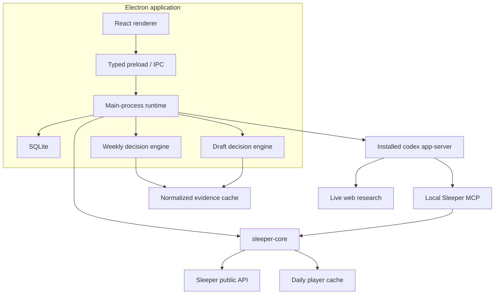

# Sleeper Caffeine Product and Implementation Plan

> Updated: 2026-07-17
>
> Status: the pull-based Weekly Command Center, live Draft Room roadmap, and draft-to-Week-1 handoff are implemented locally. Remaining work is release distribution, real-season calibration, and explicitly deferred roadmap items.

## Implementation checkpoint

The implementation now covers the plan's complete local product loop:

- Ordered SQLite migrations and durable, league-isolated weekly plans, phase briefs, evidence, actions, watchlists, and recommendation history.
- A deterministic Sleeper weekly context with transactions, FAAB, standings, matchup scoring, roster-purpose baselines, a league-relevant candidate funnel, and retrospective legal-lineup optimization.
- The manager-triggered Tuesday plan, local Wednesday aftermath, focused Thursday lineup pass, and weekend execution check, with explicit refresh versus AI-generation semantics.
- A full Weekly Plan interface, Front Office summary, action dispositions, alternatives, evidence disclosures, phase-local retries, and conversational-plan context.
- The live multi-team Draft Room, lightweight polling, deterministic board signals, board-bound AI plans, completed-board archive, and Week 1 watchlist handoff.
- Cross-league evidence isolation, race-safe reconciliation, strict structured-output validation, source grounding, browser/Storybook coverage, and a packaged Electron smoke suite.

The app remains deliberately read-only and pull-based. Signing, notarization, publishing, background scheduling, paid ranking providers, and Sleeper write automation are not silently folded into this implementation.

## 1. Product north star

Sleeper Caffeine is a read-only fantasy football front office for managers who want to operate with a disciplined, evidence-backed process.

It combines:

- Deterministic league, roster, draft, matchup, and transaction data from Sleeper.
- Live web research through Codex app-server.
- Opinionated recommendations and credible alternatives.
- Persistent plans, sources, decisions, and outcomes.
- A conversational analyst that helps the manager challenge and refine the plan.

The desired feeling is not “AI runs my team” or merely “this saved me time.” It is:

> I understand my league, I am finding overlooked edges, and I am managing this roster like a professional front office.

The first release remains read-only. It never submits a draft pick, changes a lineup, places a waiver claim, or sends or accepts a trade.

## 2. Product principles

1. **The manager initiates meaningful work.** Refreshes and AI runs happen inside the open app. No background scheduling, tray process, or push notifications in this phase.
2. **Refresh and analysis are different actions.** Refresh fetches and normalizes data without spending an AI turn. Build, Refine, and Regenerate explicitly invoke Codex.
3. **Recommend and explain.** Every major surface offers a clear current plan plus ranked alternatives and the evidence that separates them.
4. **One coherent plan per decision context.** Draft advice is bound to a draft board. Weekly advice is bound to a league, season, week, snapshot, and evidence set.
5. **AI reasons; code enforces.** Deterministic code validates availability, roster rules, lineup legality, claim dependencies, identifiers, freshness, and lifecycle transitions.
6. **Search is discovery, not evidence.** The app cites the actual pages used and exposes source freshness and uncertainty.
7. **Plans are durable but revisable.** A manager can complete, dismiss, decline, or supersede recommendations without losing history.
8. **No activity theatre.** The app encourages deliberate inspection and roster improvement, not transactions for their own sake.
9. **Each league is its own workspace.** Plans, chat, evidence, decisions, and history do not bleed across leagues.
10. **Drafting remains first-class.** Weekly management extends the product; it does not replace the draft room or general research tools.

## 3. Two first-class product modes

### Draft and research

Useful before and during drafts:

- League onboarding and roster selection.
- Roster room and team analysis.
- Trade research.
- Live multi-team draft board.
- Deterministic candidate ranking.
- Candidate pins/research list.
- Board-bound Caffeine Plan with a primary target, fallbacks, later-pick strategy, sources, and lifecycle reconciliation.
- Conversational research scoped to the active league.

The Draft Room stays in navigation after the weekly experience ships. Its empty, scheduled, live, and completed states remain useful for preparation and retrospective review.

### Weekly management

Useful during the regular season:

- A manager-triggered Tuesday plan.
- Waiver and roster-spot decisions.
- A weekly competitive-lane assessment.
- One focused trade-market observation.
- A Wednesday aftermath review.
- A Thursday lineup refinement.
- Weekend inactive, flexibility, and stash checks.
- A decision checklist and outcome history.

The weekly experience is one evolving `LeagueWeek`, not a collection of unrelated reports.

## 4. Current platform baseline

The following foundation is already implemented and should be preserved:

- pnpm monorepo with Electron, React, TypeScript, and electron-vite.
- Sandboxed renderer and typed preload/IPC boundary.
- Internal UI primitives, CSS Modules, semantic tokens, and feature slices.
- TanStack Query for canonical renderer state and mutations.
- SQLite snapshots, AI reports, chat history, model settings, and draft pins.
- Independently usable `sleeper-core` and Sleeper MCP packages.
- Installed Codex discovery, dedicated `CODEX_HOME`, ChatGPT OAuth, persistent threads, structured outputs, streaming, and live web search.
- Multi-league onboarding and active-league switching.
- Front Office, Roster Room, Team Analysis, Trade Lab, Draft Room, Settings, and assistant-ui analyst drawer.
- Unit, browser, MCP contract, Codex handshake, Storybook, build, and packaged-Electron smoke coverage.
- macOS/Windows/Linux-aware renderer and packaging foundation.

Existing reports and chat continue to work while the weekly system is introduced incrementally.

## 5. Target architecture



### Shared decision-engine pattern

Both draft and weekly intelligence follow the same pipeline:

```text
Fresh deterministic state
    -> relevant-change detection
    -> bounded candidate cohort
    -> focused evidence gathering
    -> structured AI synthesis
    -> deterministic validation
    -> persisted plan and micro-summary
    -> lifecycle reconciliation after refresh
```

Draft and weekly plans may share evidence, identity resolution, source presentation, hashing utilities, and lifecycle conventions. They should retain domain-specific schemas and validation rules.

## 6. The weekly operating model

Every week, Caffeine should help the manager make five decisions:

1. Best legal starting lineup.
2. Ranked waiver plan.
3. One or more roster-spot upgrades.
4. Current competitive lane.
5. At least one trade-market observation.

The central roster rule is that every player should serve at least one purpose:

- **Start:** belongs in the current lineup or is a legitimate weekly rotation option.
- **Insure:** directly protects an important starter or scarce position.
- **Appreciate:** can gain durable dynasty value on a plausible development path.
- **Pop:** can become dramatically more useful after one plausible event.

A player serving none of these purposes becomes an Exit candidate. The app should show this classification and its rationale; it should not pretend the classification is objective truth.

### Weekly cadence

| Phase     | Manager-triggered product job                                                                                                         |
| --------- | ------------------------------------------------------------------------------------------------------------------------------------- |
| Tuesday   | Build the substantial Weekly Plan: lane, Add Now, Watch, Exit, waiver ladder, roster upgrades, and one market observation.            |
| Wednesday | Refresh and review waiver outcomes, bids, drops, congestion, and newly free players. Generate a small refinement only when requested. |
| Thursday  | Build/refine the preliminary lineup, close calls, conditions, and flex-preservation moves.                                            |
| Friday    | Revisit the market observation and roster portfolio through the current competitive lane.                                             |
| Saturday  | Identify asymmetric stashes and replace dead bottom-of-roster depth.                                                                  |
| Sunday    | Run a user-triggered inactive and late-swap sweep.                                                                                    |
| Monday    | Surface final stash optionality and record observations without encouraging tilt.                                                     |

Days guide the interface but do not hard-lock it. A manager can build or revisit a plan whenever needed.

## 7. Primary weekly domain model

`LeagueWeek` is the durable aggregate for one league, season, and NFL week.

```ts
type LeagueWeekKey = {
  leagueId: string;
  season: string;
  week: number;
};

type LeagueWeek = LeagueWeekKey & {
  phase: "tuesday" | "wednesday" | "thursday" | "weekend" | "complete";
  latestSnapshotAt: string;
  currentPlanId: string | null;
  competitiveLane: "contender" | "retooler" | "uncertain" | null;
  planStatus:
    | "not_built"
    | "current"
    | "data_changed"
    | "research_stale"
    | "superseded";
  meaningfulChanges: WeeklyChange[];
  actionSummary: {
    pending: number;
    completed: number;
    dismissed: number;
  };
};
```

The lane is reassessed every week. It is a recommendation with reasons, confidence, and contrary evidence—not a permanent team setting.

### Plan identity and lifecycle

Every persisted weekly plan records:

- `leagueId`, `season`, and `week`.
- Source snapshot ID and `inputHash`.
- `evidenceHash` and evidence freshness window.
- Generation time, model, reasoning effort, prompt version, and schema version.
- Current lifecycle status and reason.
- The complete structured plan.
- A compact micro-summary derived from that plan without new research.

Refreshing Sleeper does not automatically invalidate a plan merely because time advanced. Reconciliation compares material inputs:

- My roster changed.
- An advised player is no longer available.
- A relevant transaction occurred.
- Waiver budget or priority changed.
- A material injury/status/depth-chart signal changed.
- The week or league phase changed.
- Research exceeded its freshness window.

Non-material refreshes leave the plan current. Material changes produce `data_changed` with an explicit list and a manager-triggered **Refine plan** action.

## 8. Target persistence model

Before the first breaking change, replace ad hoc `CREATE TABLE IF NOT EXISTS` evolution with ordered schema migrations using SQLite `user_version` or a dedicated migrations table.

New tables:

| Table                  | Purpose                                                                                         |
| ---------------------- | ----------------------------------------------------------------------------------------------- |
| `league_weeks`         | One aggregate row per league/season/week, current phase, latest plan, and summarized status.    |
| `weekly_plan_versions` | Immutable structured plans, hashes, provenance, generation settings, and lifecycle metadata.    |
| `weekly_actions`       | Trackable recommendations linked to a plan and optional player/roster/transaction identifiers.  |
| `sleeper_events`       | Deduplicated normalized roster, transaction, waiver, matchup, and status changes.               |
| `watchlist_entries`    | Persistent player hypotheses, triggers, state, and optional expiry across weeks.                |
| `evidence_claims`      | Reusable timestamped player/team claims with category, source, URL, effective week, and expiry. |
| `provider_identities`  | Sleeper player IDs mapped to identifiers required by optional evidence providers.               |

Initial action states:

```text
pending
completed
dismissed
declined
failed
not_possible
observed_in_sleeper
superseded
```

`observed_in_sleeper` is a reconciliation hint, not an assertion of intent. The UI asks the manager to confirm completion when a matching roster or transaction change is detected.

Dismissal may include an optional reason. Regeneration receives relevant dispositions so it does not immediately repeat a declined trade or dismissed claim unless material evidence changed.

## 9. Deterministic data plane

An explicit Refresh should fetch and normalize, where applicable:

- League, scoring, roster, flex, taxi, reserve, waiver, and FAAB settings.
- Every roster and manager, including record, points, waiver position, and budget used.
- Current and recent matchup data.
- Current-week transactions with full settings and metadata, including waiver bids and failure context when present.
- Drafts, picks, and traded picks.
- Trending additions and drops.
- The daily player directory without discarding useful status, injury, search-rank, experience, or depth-chart fields.
- The active draft board when a draft exists.

The resulting immutable raw snapshot must include the matchup and transaction inputs used by analysis, not only the materialized dashboard.

Derived local calculations:

- Snapshot-to-snapshot changes.
- Roster additions, drops, trades, and ownership changes.
- Remaining FAAB and waiver priority.
- League standings and points ranks.
- Maximum/optimal points when sufficient player-point data exists; otherwise expose it as unavailable.
- Position and roster congestion.
- Initial roster-purpose signals.
- Available-player candidate scores.
- Valid add/drop pairings and contingency conflicts.
- Legal lineup assignments in the later Thursday slice.

Code must degrade explicitly when Sleeper does not expose a value. Missing maximum points or projections should never be filled with an invented number.

## 10. Evidence and research plane

The open-source product should work with Sleeper plus Codex live web research. A deterministic ranking provider is an enhancement, not a prerequisite.

Evidence is stored as claims rather than unstructured copied articles:

```ts
type EvidenceClaim = {
  id: string;
  leagueId: string | null;
  playerId: string | null;
  category: "usage" | "role" | "injury" | "market" | "matchup" | "projection";
  claim: string;
  metricName: string | null;
  metricValue: number | null;
  sourceTitle: string;
  sourceUrl: string | null;
  sourceType: "sleeper" | "web" | "provider";
  fetchedAt: string;
  effectiveWeek: number | null;
  expiresAt: string | null;
};
```

Rules:

- Reuse fresh evidence across Tuesday, Thursday, Draft Room, reports, and chat.
- Surface conflicting claims instead of silently selecting one.
- Prefer first-party team/NFL sources for definitive injury or roster news.
- Do not scrape subscription sites or bypass authentication.
- Add optional licensed/free projections or rankings later through an adapter contract.
- Keep source links collapsed by default beneath concise rationale.

## 11. Codex orchestration

The app continues to use its installed `codex app-server` process, isolated `CODEX_HOME`, read-only sandbox, `approvalPolicy: never`, local Sleeper MCP, and live web search.

Weekly work uses purpose-specific threads such as:

```text
league / season / week / weekly-plan
league / season / week / lineup-refinement
league / conversation
```

Thread memory is conversational context, not source-of-truth data. Every generation carries the current immutable context and evidence identities.

### Cost and effort policy

- **Tuesday:** one substantial, manager-triggered synthesis plus a small editorial micro-summary.
- **Wednesday:** no AI by default; offer a focused refinement if meaningful new data exists.
- **Thursday:** one focused, manager-triggered lineup pass, researching only unresolved close calls.
- **Chat:** unlimited manager-triggered exploration using the selected model and effort.
- **Regenerate:** always available and always explicit.

The first implementation can use the user-selected model for all turns. Separate “deep plan” and “quick editorial” model settings should be added only if measurements show a meaningful quality, latency, or quota benefit.

## 12. Tuesday vertical slice

### Objective

Replace the Waivers placeholder with the first complete regular-season workflow. Starting from a freshly refreshed league, the manager can explicitly build, review, act on, dismiss, and regenerate a coherent Tuesday Weekly Plan.

This slice must feel useful even before third-party projections or automated scheduling exist.

### Scope

Included:

- Current-week deterministic context and meaningful-change detection.
- Weekly competitive lane with reasons and uncertainty.
- Ranked Add Now, Watch, and Exit lists.
- A contingent waiver ladder with add, drop, FAAB range, priority, and alternatives.
- Roster-purpose audit for the manager’s roster.
- One focused trade-market observation with options.
- Concise rationale with expandable sources.
- Durable action checklist and dispositions.
- Regenerate and Refine semantics.
- Front Office teaser and Weekly Plan page.
- Analyst chat awareness of the current weekly plan.

Not included:

- Submitting claims or trades.
- Background refresh, scheduling, tray behavior, or push notifications.
- Full Wednesday reconciliation UI.
- Start/sit optimization or Sunday inactive checks.
- Mandatory paid projections or ranking providers.
- AI summaries for the entire available-player universe.

### Entry states

The Weekly Plan page supports:

1. **Unsupported/preseason:** explain that weekly data is not active; link to Draft Room and Team Analysis.
2. **Ready to refresh:** no current snapshot for the active week.
3. **Ready to build:** current deterministic data exists; primary CTA is **Build my plan**.
4. **Building:** stream stage-oriented progress without rendering raw JSON or source payloads.
5. **Current:** show the complete plan and checklist.
6. **Data changed:** keep the plan readable, show exactly what changed, and offer **Refine plan**.
7. **Research stale:** distinguish old evidence from changed Sleeper data and offer **Regenerate**.
8. **Failed:** preserve the last successful plan and present a retryable error.
9. **Signed out:** keep deterministic context visible and offer ChatGPT login for plan generation.

### Manager flow

```text
Open active league
  -> Refresh data
  -> Review “What changed” summary
  -> Build my plan
  -> Read recommended plan
  -> Compare credible alternatives
  -> Inspect sources as needed
  -> Mark actions complete, dismissed, declined, failed, or not possible
  -> Refresh later
  -> Confirm Sleeper-observed actions
  -> Refine only if useful
```

### Page information architecture

#### Header

- `WEEK N · TUESDAY PLAN`
- Latest Sleeper refresh time.
- Plan/evidence freshness state.
- **Refresh data** secondary action.
- **Build my plan**, **Refine plan**, or **Regenerate** primary action depending on state.

#### Plan brief

- Conclusion-led headline.
- Two-sentence executive summary.
- Competitive-lane badge, confidence, supporting reasons, and contrary evidence.
- “Based on” row showing snapshot, research time, model, and source count.

#### Five-decision scorecard

Always expose the state of:

1. Lineup — “Thursday pass not built yet” in this slice.
2. Waivers — count of ranked claims.
3. Roster upgrades — count of actionable upgrades.
4. Competitive lane — contender/retooler/uncertain.
5. Market — one active observation.

This connects Tuesday to the eventual whole-week operating system without pretending the Thursday work is complete.

#### Current plan

An ordered checklist of opinionated recommendations. Each item shows:

- A direct action headline.
- Priority and action type.
- Player(s), roster spot, and FAAB range when applicable.
- Concise rationale.
- Confidence and key uncertainty.
- Expandable sources.
- Complete, dismiss, declined, failed, and not-possible controls where relevant.

#### Waiver ladder

A structured table or stacked list:

```text
Priority  Add                  Drop                 Bid             Why
1         Player A             Exit candidate 1     8–12%           Immediate role + roster fit
2         Player B             Exit candidate 1     3–6%            Upside alternative
3         Player C             Exit candidate 2     $0–2%           Speculative churn
```

Claims sharing the same drop player form a visible contingency group. The UI warns when the proposed sequence is impossible under known roster settings.

FAAB uses both percentage of the league’s starting budget and a calculated absolute range. Recommendations account for remaining budget; they are not hardcoded to a $1,000 league.

#### Other good options

Show credible alternatives rather than hiding them behind chat:

- Why each alternative is not the primary recommendation.
- What manager preference or new evidence would make it preferable.
- The cost/risk difference versus the current plan.

#### Add Now / Watch / Exit

- **Add Now:** players whose usefulness probability materially increased.
- **Watch:** hypothesis plus the next observable trigger.
- **Exit:** the manager’s least purposeful roster spots, in drop order.

Exit players show their current Start/Insure/Appreciate/Pop classifications—or explicitly show that none apply.

#### Market observation

One focused idea, not a batch of generic offers:

- Opportunity and likely partner/archetype.
- Recommended action, such as ask, offer, list, or monitor.
- One or two alternate approaches.
- Checklist state including `declined` and optional note.
- Link to a deeper Trade Lab conversation/report.

#### Evidence drawer

Sources are collapsed by default and grouped by recommendation. Each entry shows title, claim supported, source type, and freshness. Analytics may appear inside rationale without requiring a separate dense analytics dashboard.

### Deterministic Tuesday context

Before invoking Codex, build and validate a bounded `TuesdayContext`:

```ts
type TuesdayContext = {
  key: LeagueWeekKey;
  snapshotId: string;
  inputHash: string;
  capturedAt: string;
  league: {
    scoring: unknown;
    rosterPositions: string[];
    waiverType: string | null;
    faabStartingBudget: number | null;
    teams: number;
  };
  myTeam: {
    rosterId: number;
    record: unknown;
    standingsRanks: unknown;
    faabRemaining: number | null;
    waiverPosition: number | null;
    players: unknown[];
    rosterPurposeBaseline: unknown[];
  };
  leagueTable: unknown[];
  recentMatchups: unknown[];
  recentTransactions: unknown[];
  meaningfulChanges: WeeklyChange[];
  addCandidates: unknown[];
  exitCandidates: unknown[];
  previousPlan: {
    planId: string;
    dispositions: unknown[];
  } | null;
};
```

The exact IPC schema should use explicit Zod objects rather than the `unknown` placeholders above.

### Candidate funnel

Avoid researching hundreds of players:

1. Begin with players absent from all current rosters.
2. Apply position eligibility and league-format relevance.
3. Score locally using Sleeper search rank, trending adds/drops, injury/status, positional scarcity, roster fit, youth/upside signals, and plausible upgrade over Exit candidates.
4. Keep approximately 25–40 plausible candidates for the local UI.
5. Build a research cohort of approximately 8–15 players, with position diversity and explicit inclusion of manager-pinned/watchlist players.
6. Ask Codex to deeply compare only that cohort.

The deterministic score is a funnel, not the final recommendation. AI may promote or demote a candidate, but it must explain meaningful differences from the baseline.

### Structured Tuesday output

The contract should be domain-specific rather than extending the generic report schema:

```ts
type TuesdayPlanOutput = {
  headline: string;
  summary: string;
  confidence: "low" | "medium" | "high";
  competitiveLane: {
    lane: "contender" | "retooler" | "uncertain";
    confidence: "low" | "medium" | "high";
    reasons: string[];
    contraryEvidence: string[];
  };
  actions: TuesdayActionOutput[];
  waiverClaims: Array<{
    priority: number;
    addPlayerId: string;
    dropPlayerId: string | null;
    contingencyGroup: string;
    faabPercentMin: number | null;
    faabPercentTarget: number | null;
    faabPercentMax: number | null;
    rationale: string;
    confidence: "low" | "medium" | "high";
  }>;
  addNow: PlayerRecommendation[];
  watch: Array<PlayerRecommendation & { trigger: string }>;
  exit: Array<
    PlayerRecommendation & {
      dropRank: number;
      rosterPurposes: Array<"start" | "insure" | "appreciate" | "pop">;
    }
  >;
  rosterAudit: RosterPurposeAssessment[];
  marketObservation: {
    headline: string;
    recommendation: string;
    partnerRosterIds: number[];
    alternatives: string[];
    rationale: string;
  };
  alternatives: PlanAlternative[];
  sources: EvidenceSource[];
  uncertainties: string[];
  refreshTriggers: string[];
};
```

Validation after generation must ensure:

- Every player ID exists in the frozen context.
- Every Add Now/waiver player is still available in that snapshot.
- Every drop player is on the manager’s roster and is not duplicated incompatibly.
- Claim priorities are unique and consecutive.
- FAAB values are ordered, non-negative, and valid for league settings.
- Recommended roster IDs exist.
- Sources use valid URLs when present.
- The model does not claim to have submitted any action.

### AI generation stages

1. Freeze the `TuesdayContext` and calculate `inputHash`.
2. Call a new/expanded Sleeper MCP weekly-context tool to verify the league facts visible to Codex.
3. Search the web only for the research cohort and decision-relevant team context.
4. Request one `TuesdayPlanOutput` structured response.
5. Validate and enrich it with canonical player/team objects.
6. Persist the plan, sources, and actions atomically.
7. Run a no-tools editorial condensation for the Front Office micro-summary.
8. Re-fetch/reconcile the dashboard before presenting the result so changes during a long turn are visible.

Raw streamed JSON or tool payloads must never be rendered as plan prose. During generation, the UI shows stable stages such as “Reading league,” “Researching candidates,” and “Building contingencies.”

### Front Office integration

The Intelligence Desk gains a Weekly Plan card:

- Empty: “Build your Week N plan.”
- Current: micro-headline, two-line summary, lane badge, action count, freshness, and **Open plan**.
- Changed: material-change count and **Review changes**.
- Stale: evidence age and **Regenerate**.

Draft intelligence remains present whenever the league has a pending/live/recent draft. Front Office can prioritize Draft Room during an active draft and Weekly Plan during the regular season without removing either surface.

### Analyst integration

Chat receives the active league/week and current plan ID. It can explain, compare, or challenge the plan. If chat produces a better decision, the UI should eventually offer an explicit **Add to plan** or **Replace recommendation** action; chat must not silently mutate the persisted plan in the first slice.

### IPC and package changes

Expected additions:

```text
packages/ipc-contract
  LeagueWeekSchema
  TuesdayContextSchema
  TuesdayPlanOutputSchema
  WeeklyPlanSchema
  WeeklyActionSchema
  weekly IPC channels and runtime events

packages/sleeper-core
  weekly-context.ts
  snapshot-diff.ts
  transaction-normalization.ts
  roster-purpose-baseline.ts
  waiver-candidate-ranking.ts

packages/sleeper-mcp
  get_weekly_context tool
  complete transaction/FAAB output

apps/desktop/src/main
  migrations/
  weekly-plan.ts
  weekly-reconciliation.ts
  weekly-evidence.ts
  store methods for weeks/plans/actions/evidence

apps/desktop/src/renderer/features/weekly
  WeeklyPlanPage
  PlanHeader
  FiveDecisionScorecard
  ActionChecklist
  WaiverLadder
  CandidateLists
  CompetitiveLane
  MarketObservation
  EvidenceDrawer
```

The existing generic `ai_reports` table can continue to serve Team Analysis and Trade Lab during this slice. Weekly plans should use the new domain tables.

### Test plan

#### Unit/domain

- Snapshot diff emits stable, deduplicated changes.
- Transaction normalization preserves waiver bids and metadata.
- Remaining FAAB uses league settings correctly.
- Candidate funnel excludes rostered/ineligible players and remains deterministic.
- Contingency groups never produce impossible simultaneous drops.
- Output validation rejects unknown players, rosters, invalid bids, and duplicate priorities.
- Plan reconciliation distinguishes no change, material change, research staleness, and a new week.
- Action disposition transitions are explicit and valid.

#### Store/migrations

- Upgrade an existing database without losing leagues, reports, chat, or draft plans.
- Persist/reload every weekly schema.
- Keep immutable plan history across regeneration.
- Cascade league deletion through new tables.
- Clear-local-data removes all weekly data.

#### Runtime

- Refresh spends no Codex turn.
- Build produces one plan plus one micro-summary.
- Failed micro-summary does not discard a valid full plan.
- A board or roster change during generation is reconciled before display.
- Dismissed/declined actions are included in regeneration context.
- Signed-out and unavailable-Codex states preserve deterministic data.

#### Renderer/browser

- Build from the ready state and render progress safely.
- Render plan plus alternatives, waiver ladder, sources, and lane.
- Mark, dismiss, and decline actions.
- Show changed-data and stale-research states.
- Keep the previous successful plan visible after an error.
- Link to Trade Lab, Draft Room, and analyst chat.
- Remain usable at the supported minimum desktop size.

#### Fixtures

Cover at least:

- FAAB and rolling-waiver leagues.
- Redraft, keeper, dynasty, superflex, and TE-premium formats.
- Taxi and IR rosters.
- No available maximum-points data.
- No worthwhile waiver candidates.
- Player already rostered between build and display.
- Zero remaining FAAB.
- Empty transaction week.
- A declined trade idea that must not immediately recur.

### Tuesday vertical-slice acceptance criteria

- A regular-season manager can refresh and explicitly build a Week N plan.
- No AI turn occurs during refresh, launch, navigation, or action-state changes.
- The plan contains a recommended course and credible alternatives.
- The plan includes lane, Add Now, Watch, Exit, waiver contingencies, roster-purpose audit, and one market observation.
- Every referenced player and roster resolves to canonical frozen context.
- Every material current claim has an inspectable source or is labeled as Sleeper-derived.
- The manager can track and dismiss recommendations without losing history.
- Refresh reconciles the plan and explains material changes without regenerating it.
- Front Office exposes a useful micro-summary and freshness state.
- Draft Room, draft plan generation, candidate pins, Team Analysis, Trade Lab, and chat continue to pass their existing tests.
- Typecheck, lint, unit tests, browser tests, Storybook build, production build, and packaged smoke suite remain green.

### Implementation sequence

#### PR 1 — migrations and richer Sleeper snapshots

- Add ordered schema migrations.
- Preserve matchups, full transactions, settings, metadata, trending adds/drops, and richer player attributes.
- Add transaction normalization and snapshot-diff tests.
- Do not add AI or new UI yet.

#### PR 2 — weekly domain and deterministic inspection

- Add `LeagueWeek`, context, changes, baseline candidate, roster-purpose, and persistence schemas.
- Add a developer-facing fixture/inspection route or test harness.
- Add `get_weekly_context` to the MCP.
- Validate deterministic output across league formats.

#### PR 3 — Tuesday generation and lifecycle

- Add the structured Codex prompt and schema.
- Validate/enrich/persist plans and actions.
- Add plan hashes, source freshness, regeneration, and reconciliation.
- Add micro-summary generation.

#### PR 4 — Weekly Plan product surface

- Replace the Waivers placeholder with Weekly Plan.
- Build the plan brief, scorecard, checklist, waiver ladder, candidate lists, lane, market observation, and sources.
- Add action dispositions and Front Office integration.
- Add browser tests and Storybook fixtures for all states.

#### PR 5 — hardening

- Exercise a real public test league and opt-in live Codex run.
- Tune cohort size, prompt, validation messages, and progress stages.
- Verify packaged Electron behavior and migration from an existing local database.
- Update README screenshots and contributor documentation.

## 13. Draft Room commitment and roadmap

The Draft Room is not deprecated by the weekly plan. It remains the product’s primary preseason and live-draft workspace.

### Preserve these invariants

- A multi-team grid showing completed picks and current ownership.
- Slow drafts remain live when picks exist even if Sleeper still reports the draft as `pre_draft`.
- Commissioner undo and non-contiguous upstream state resolve to the first genuinely open pick instead of corrupting the board.
- Correct handling of traded picks and upcoming owned selections.
- A deterministic candidate baseline that remains useful without ChatGPT login.
- A bounded research cohort rather than whole-pool AI summaries.
- Primary target, approved fallbacks, later-pick strategies, and ranking rationale.
- Board/input hashes and plan lifecycle reconciliation.
- Explicit Refresh versus Regenerate actions.
- Candidate pins/research list that forces research inclusion without changing deterministic rank.
- Read-only language and behavior.

Auction drafts remain explicitly unsupported until they receive a separate budget-oriented design. They should not be forced into the linear/snake board model.

### Season handoff

Draft completion should connect the two product modes without erasing either one:

1. Preserve the final board, completed Caffeine Plan, and selected-player outcomes.
2. Seed Week 1 roster-purpose and watchlist candidates from drafted players and pinned research targets.
3. Mark preseason evidence with its original freshness/effective date rather than presenting it as current-week truth.
4. Offer **Build Week 1 outlook** when useful regular-season data becomes available.
5. Keep Draft Room accessible for retrospective review, rookie drafts, and the manager's other leagues.

### Next draft improvements

- Optional short-interval polling only while Draft Room is open, with an explicit toggle and no AI turn.
- Tier and positional-run detection.
- Better pick-trade-aware target windows.
- A “What changed since this plan?” summary using the shared diff model.
- Reuse fresh player evidence from preseason Team Analysis, Draft Room, and chat.
- Draft-plan action history and retrospective review after completion.
- Better empty/scheduled/completed draft research states for leagues not currently on the clock.

Draft improvements can proceed alongside later weekly phases once the Tuesday data spine is stable. Shared identity/evidence work should be implemented once and consumed by both tracks.

## 14. Later weekly vertical slices

### Wednesday aftermath

- Reconcile submitted/observed roster changes against Tuesday actions.
- Show claims won/lost, bid amounts, surprising spend, and important drops.
- Detect free pickups, overreaction drops, and new roster congestion.
- Promote watchlist hypotheses when triggers occur.
- Offer an explicit small refinement rather than a new full plan.

### Thursday lineup

- Add schedules, start times, lock status, and optional projection adapters.
- Build a deterministic legal lineup optimizer.
- Identify only true close calls for targeted research.
- Generate conditional advice and flex-preservation moves.
- Persist lineup actions inside the same `LeagueWeek`.

### Weekend execution

- User-triggered inactive sweep.
- Late-game flexibility checks.
- Saturday, Sunday, and Monday stash candidates.
- No background notification system in the initial implementation.

### Outcomes and evaluation

- Record recommendation dispositions and Sleeper-observed outcomes.
- Compare recommended, actual, and optimal lineups where data permits.
- Track waiver outcomes and recommendation confidence.
- Add historical fixture replay and prompt/schema regression tests.
- Evaluate source freshness, calibration, and discovery quality rather than raw transaction count.

## 15. Security and product boundaries

- No Sleeper password or authenticated browser session.
- OpenAI tokens remain inside the app-owned Codex home.
- No arbitrary shell or filesystem tools in the fantasy runtime.
- Renderer remains sandboxed behind typed IPC.
- MCP stays read-only and loopback-only inside the app.
- Web sources are attributed and subscription boundaries are respected.
- No future write automation without a separate threat model, confirmation design, audit trail, failure model, and explicit opt-in.

## 16. Release and repository work that remains

- The unsigned macOS package and its real preload, migration, navigation, and native-chrome paths are covered by the packaged smoke suite. Repeat platform-native inspection on Windows and Linux before publishing those artifacts.
- Add signing/notarization when maintainer credentials exist.
- Validate ChatGPT login and a complete structured generation from a clean packaged app.
- Add current screenshots/GIFs to the README.
- Publish the repository and enable CI branch protection.
- Keep `STRATEGY_GUIDE.md` as product rationale and clearly distinguish observational activity benchmarks from causal claims.

## 17. Definition of success

This phase succeeds when a manager can open any saved regular-season league, refresh it, deliberately build a trustworthy Tuesday plan, understand both the recommendation and alternatives, track what they chose to do, and return later to see what materially changed—while the live Draft Room and research experience remain fully useful.

The product should feel like one front office with two complementary time horizons:

- **Draft Room:** construct the roster intelligently.
- **Weekly Command Center:** manage and compound that roster intelligently.
