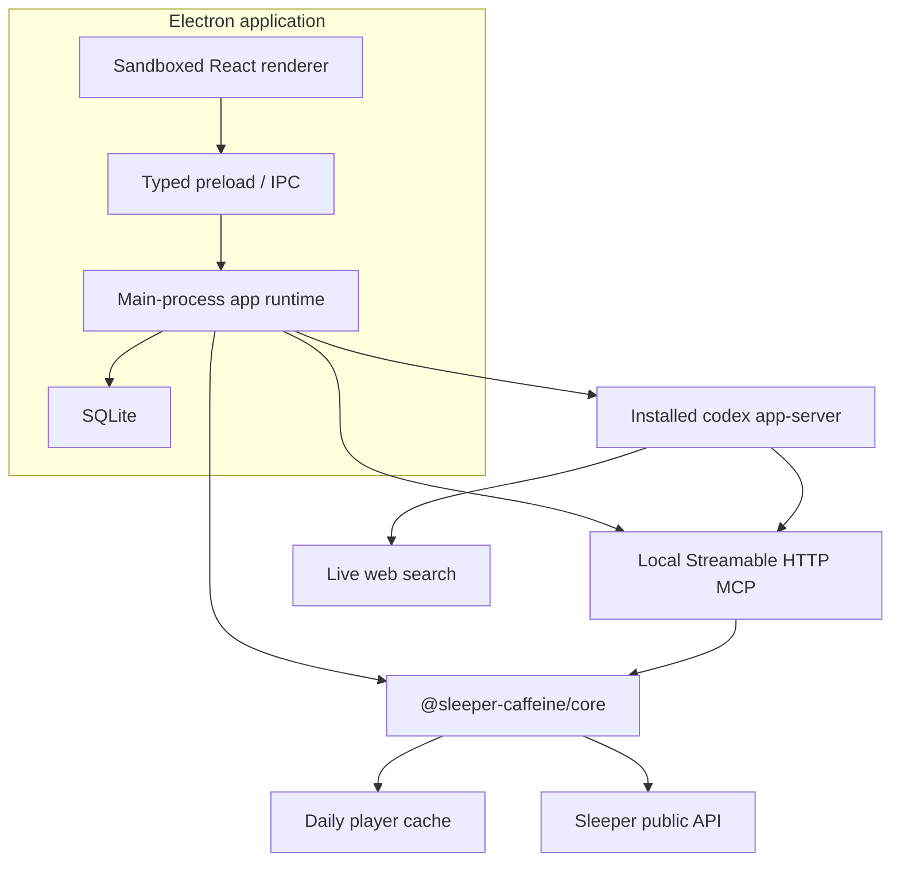

# Sleeper Caffeine Project Plan

> Status: the v1 vertical slice is implemented. The next phase establishes the long-term React, design-system, testing, and cross-platform foundation before additional product surfaces are added.

## 1. Product goal

Build an open-source desktop fantasy football front office that combines:

- Deterministic, read-only league state from Sleeper.
- A reusable Sleeper MCP server.
- Persistent local snapshots and recommendation history.
- Codex-managed ChatGPT login, threads, structured reports, and live web research.
- A polished multi-league interface that feels useful without requiring AI.

The first release is read-only. It does not change lineups, submit waivers, send or accept trades, or automate a signed-in Sleeper browser.

## 2. Decisions

| Area                     | Decision                                                                                                        |
| ------------------------ | --------------------------------------------------------------------------------------------------------------- |
| Distribution             | Open-source GitHub project from day one.                                                                        |
| Product name             | Sleeper Caffeine.                                                                                               |
| Workspace                | pnpm monorepo.                                                                                                  |
| Desktop                  | Electron, React, TypeScript, electron-vite.                                                                     |
| MCP                      | Keep the existing adapter independently usable. Add an app-managed Streamable HTTP transport.                   |
| Codex binary             | Discover an installed version; do not bundle one.                                                               |
| OpenAI authentication    | ChatGPT login only in v1, managed by `codex app-server`.                                                        |
| Codex isolation          | Dedicated app-owned `CODEX_HOME`.                                                                               |
| Safety                   | Read-only sandbox, approval policy `never`, shell disabled, no write tools.                                     |
| Web                      | Live web search is a core v1 feature. Reports distinguish discovery/search from the actual cited source.        |
| League model             | Multiple saved leagues with one active league. Persist league ID, roster ID, and user ID.                       |
| AI surfaces              | Structured cards plus a persistent conversational analyst.                                                      |
| Active v1 reports        | Team analysis, trade suggestions, and draft candidates.                                                         |
| Deferred weekly surfaces | Waiver wire and start/sit activate when regular-season data is useful.                                          |
| Draft                    | Read-only live board and on-demand candidate report; no automated drafting.                                     |
| Refresh                  | Refresh Sleeper immediately, write SQLite, invalidate reports, and spend no AI turn.                            |
| Scheduling               | Refresh on launch; later refreshes are manual in v1.                                                            |
| Retention                | Keep snapshots, reports, and recommendation history indefinitely. Hide a destructive clear control in Settings. |
| Visuals                  | Player headshots and Sleeper avatars where available; strong monogram fallbacks.                                |
| Future writes            | Separate opt-in design with confirmations; never an implicit extension of v1.                                   |

## 3. Architecture



### Why the UI does not call MCP

MCP is an agent-facing adapter, not the desktop application's internal service boundary. The Electron main process and the MCP bridge both call `sleeper-core`, which prevents protocol overhead and keeps one implementation of caching, joins, validation, retries, and league semantics.

### Why Codex app-server

A long-lived app-server provides managed ChatGPT authentication, native threads, streaming turn events, structured output schemas, MCP configuration, and live search. The desktop owns fantasy data and presentation; Codex owns OpenAI identity and model orchestration.

## 4. Package responsibilities

```text
apps/desktop
  Electron lifecycle, SQLite, onboarding, dashboard, reports, chat, settings

packages/sleeper-core
  Sleeper HTTP client, Zod schemas, cache, identity resolution, fantasy joins

packages/sleeper-mcp
  MCP registrations, stdio entry point, local Streamable HTTP bridge

packages/ipc-contract
  Shared renderer/main types, runtime schemas, report JSON schema, channel names

packages/codex-runtime
  Binary discovery, JSONL JSON-RPC, app-server lifecycle, OAuth, turns
```

## 5. Data model

SQLite tables:

| Table              | Purpose                                                                   |
| ------------------ | ------------------------------------------------------------------------- |
| `leagues`          | Saved league/team identity, active league, latest materialized dashboard. |
| `league_snapshots` | Immutable dashboard and compact raw-source snapshots.                     |
| `ai_reports`       | Structured report history and invalidation state.                         |
| `codex_threads`    | Persistent thread ID by league and purpose.                               |
| `chat_messages`    | Local conversational analyst history.                                     |

The daily full player map remains a file cache rather than being copied into every database snapshot.

## 6. Codex runtime profile

Startup configuration:

```text
CODEX_HOME=<app user data>/codex-home
codex app-server --listen stdio:// --strict-config
  --disable shell_tool
  -c web_search="live"
  -c mcp_servers.sleeper_caffeine.url="http://127.0.0.1:<port>/mcp"
  -c mcp_servers.sleeper_caffeine.required=true
```

Each thread starts with:

- `approvalPolicy: "never"`
- `sandbox: "read-only"`
- Read-only fantasy analyst instructions.
- A requirement to call Sleeper MCP before league-specific claims.
- A requirement to source current football claims from actual pages found through web search.

Each turn also applies a read-only sandbox policy with network access so live research is available. Command and file-change approval requests are declined defensively even though shell access is disabled.

Thread strategy:

```text
league / report:team_analysis
league / report:trade_suggestions
league / report:draft_candidates
league / conversation
```

Structured report turns use an output JSON schema and validate the final JSON again with Zod before persistence.

## 7. Sleeper data behavior

The fixed upstream is `https://api.sleeper.app/v1`. Supported reads include leagues, users, rosters, matchups, transactions, drafts, picks, traded picks, brackets, NFL state, trending players, and the NFL player directory.

The player directory:

- Is fetched at most daily during normal use.
- Is validated before replacement.
- Uses atomic disk writes.
- Coalesces concurrent refreshes.
- Falls back to a valid stale copy with an explicit warning.
- Is never returned wholesale to Codex.

“Available player” means absent from every current roster. It does not imply waiver clearance, lock status, or eligibility.

## 8. User flows

### League onboarding

1. Paste a Sleeper league URL or numeric league ID.
2. Fetch league, users, and rosters.
3. Present every owned roster with team/avatar/record context.
4. Select “my team.”
5. Persist league ID, roster ID, and user ID.
6. Materialize the first dashboard snapshot.

### Refresh

1. Read current Sleeper league state immediately.
2. Reuse or refresh the player cache.
3. Build a compact dashboard and draft view.
4. Append a snapshot.
5. Mark existing reports stale.
6. Do not invoke Codex.

### Generate a report

1. Require a current dashboard and ChatGPT login.
2. Resume the report-specific Codex thread or create it.
3. Tell Codex the league/user/roster identifiers.
4. Require the relevant Sleeper MCP tools.
5. Allow live web search for current context.
6. Stream progress into the UI.
7. Validate the final structured result.
8. Persist the report against the snapshot timestamp.

### Conversational analyst

Chat uses a league-specific persistent thread and local message history. Every prompt carries the active league identity; base instructions still require fresh Sleeper tool results for league-specific claims.

## 9. Security boundaries

- No Sleeper credentials are requested or stored.
- OpenAI tokens remain inside the dedicated Codex home.
- The renderer receives account email/plan/status only, never tokens.
- Inherited `OPENAI_API_KEY`, `CODEX_API_KEY`, and `CODEX_ACCESS_TOKEN` are removed from the child environment.
- The renderer has context isolation, sandboxing, no Node integration, and a narrow preload API.
- External links must be HTTPS and open in the system browser.
- The local MCP listens on loopback only.
- The initial local MCP has no bearer token by design; the data is the same public read-only fantasy data shown in the app.
- Content Security Policy restricts scripts, connections, fonts, and image hosts.
- Any future authenticated browser automation requires a new threat model and design review.

## 10. Completed implementation

- [x] Commit the original standalone MCP as the baseline (`a5ed90d`).
- [x] Convert to a pnpm monorepo.
- [x] Extract `sleeper-core` and preserve the standalone MCP CLI.
- [x] Add a session-aware Streamable HTTP MCP bridge.
- [x] Add typed IPC contracts and constrained report schemas.
- [x] Add installed-Codex discovery and app-server JSONL supervision.
- [x] Add dedicated-home ChatGPT login flow.
- [x] Add live web search and read-only runtime configuration.
- [x] Add SQLite migrations, snapshots, reports, threads, and chat history.
- [x] Add multi-league onboarding and switching.
- [x] Add dashboard, roster, report, trade, draft, weekly placeholders, and settings.
- [x] Add player/avatar imagery with fallbacks.
- [x] Add per-card generation and stale-report handling.
- [x] Add deterministic manual refresh and launch refresh.
- [x] Add a board-aware draft baseline, researched Caffeine Plans, and persisted candidate pins.
- [x] Replace the custom analyst transcript with assistant-ui, structured Markdown, streaming state, and paginated local history.
- [x] Add unit, MCP contract, live Sleeper, and Codex handshake coverage.
- [x] Add open-source documentation and CI.

## 11. Release checklist

- [x] Add application icon assets for macOS, Windows, and Linux.
- [ ] Produce and manually inspect unsigned packages on all target platforms.
- [ ] Add release signing/notarization when maintainership credentials exist.
- [ ] Add screenshots/GIFs to the GitHub README.
- [ ] Validate ChatGPT browser login from a clean packaged application.
- [ ] Validate a complete structured AI report after login.
- [ ] Add database schema-version migrations before the first breaking schema change.
- [ ] Publish the repository and enable CI branch protection.

## 12. Next phase: renderer foundation

### Objective

Turn the implemented renderer into a maintainable desktop application foundation before adding waiver, start/sit, and other major features.

This phase will:

- Replace the monolithic renderer with feature-oriented React boundaries.
- Establish a small internal UI system using CSS Modules and semantic custom-property tokens.
- Move Electron/SQLite async state onto a deliberate TanStack Query data layer.
- Add real-browser component and interaction coverage.
- Normalize typography, spacing, focus behavior, dialogs, drawers, and form controls.
- Remove implicit macOS assumptions so Windows and Linux can be supported without redesigning the renderer.

Pixel-for-pixel preservation is not a constraint. The existing product identity should remain recognizable, but shared components may normalize spacing, typography, color usage, and interaction behavior as each surface migrates.

### Decisions

| Area                 | Decision                                                                                                     |
| -------------------- | ------------------------------------------------------------------------------------------------------------ |
| UI system            | Keep it internal under `apps/desktop/src/renderer/components/ui`; do not create a public workspace package.  |
| Styling              | CSS Modules for components/features; custom properties for global semantic tokens.                           |
| Token source         | Begin with hand-maintained `tokens.css`; do not add token-generation tooling until another consumer exists.  |
| Async renderer state | Use TanStack Query for bootstrap reads and IPC mutations.                                                    |
| Streaming chat state | Keep assistant-ui's external runtime for run-scoped conversational streaming.                                |
| Local UI state       | Keep state close to features; use reducers/discriminated unions for multi-step flows.                        |
| Storybook            | Add after the first stable primitives; commit stories and verify its build in CI, but do not host it yet.    |
| Accessibility        | Build sound semantics, focus behavior, and reduced-motion support into primitives; no formal WCAG audit yet. |
| Platform target      | Desktop only, with renderer and shell behavior designed for macOS, Windows, and Linux.                       |
| Migration style      | Incremental vertical slices that remain runnable and testable after every merge.                             |

### Target renderer structure

```text
apps/desktop/src/renderer/
  app/
    App.tsx
    AppProviders.tsx
    AppShell.tsx
    query-client.ts
    runtime-events.ts

  api/
    caffeine-client.ts
    query-keys.ts
    queries.ts
    mutations.ts

  components/ui/
    Avatar/
    Badge/
    Button/
    Dialog/
    Drawer/
    Field/
    Icon/
    IconButton/
    Panel/
    Select/
    Spinner/
    StatusDot/

  features/
    assistant/
    draft/
    front-office/
    leagues/
    onboarding/
    reports/
    roster/
    settings/

  styles/
    tokens.css
    reset.css
    globals.css
```

`packages/ipc-contract` remains the renderer/main contract boundary. Feature components must not import Electron APIs directly; all IPC access goes through the typed renderer client and query/mutation hooks.

### Token model

Tokens use three layers:

1. Primitive values: palettes, font families, raw dimensions.
2. Semantic roles: canvas, surfaces, text, borders, actions, statuses, focus, and motion.
3. Component decisions: control heights, panel padding, drawer width, title-bar height, and similar reusable measurements.

Required token groups:

```text
color       canvas, surfaces, text, borders, actions, statuses
typography  families, sizes, weights, line heights, tracking
space       one consistent spacing scale
size        controls, icons, avatars, app chrome
radius      controls, cards, panels, overlays
shadow      raised controls, menus, drawers, dialogs
motion      duration and easing, with reduced-motion overrides
layer       base, navigation, menu, drawer, dialog, notification
```

Typography guardrails:

- `10px` is the absolute floor for metadata.
- `12px` is the floor for ordinary body copy.
- Interactive controls should normally use at least `14px` labels.
- Font sizes and line heights use semantic tokens rather than page-specific values.

Raw colors, shadows, radii, and spacing values should not be introduced in CSS Modules when an appropriate semantic token exists. Deliberate one-off data visualization colors must be documented beside the rule.

### TanStack Query integration

The Electron main process and SQLite own canonical application data. The renderer treats the preload API as an asynchronous server-state boundary even though it uses IPC rather than HTTP.

Default query behavior:

```ts
new QueryClient({
  defaultOptions: {
    queries: {
      staleTime: Infinity,
      refetchOnWindowFocus: false,
      refetchOnReconnect: false,
      retry: false,
    },
    mutations: {
      retry: false,
    },
  },
});
```

Runtime-event behavior:

| Runtime event       | Renderer behavior                                                        |
| ------------------- | ------------------------------------------------------------------------ |
| `bootstrap_changed` | Invalidate the bootstrap query.                                          |
| `codex_status`      | Update the matching status inside cached bootstrap data.                 |
| `mcp_status`        | Update the matching status inside cached bootstrap data.                 |
| Chat run events     | Feed the assistant-ui run adapter; persist only completed message rows.  |
| Draft changes       | Invalidate or update the active dashboard without regenerating AI cards. |

Each operation receives its own mutation key and state. Refreshing Sleeper, generating a report, changing AI settings, switching a league, toggling a candidate pin, logging in, and clearing data must no longer share a single global `busy` string.

Mutation success should prefer returned canonical `Bootstrap` data when available. Otherwise, it should invalidate the narrowest affected query. AI-generating mutations are never automatically retried.

### Internal UI primitives

The first primitive set is intentionally small:

| Primitive    | Responsibilities                                                                |
| ------------ | ------------------------------------------------------------------------------- |
| `Button`     | Variants, sizes, loading, disabled state, icons, and safe default button type.  |
| `IconButton` | Accessible label, tooltip/title, target size, loading, and focus state.         |
| `Panel`      | Surface level, border treatment, padding, and optional interactive state.       |
| `Badge`      | Neutral, accent, live, stale, warning, error, and success statuses.             |
| `Avatar`     | Image loading, fallback monogram, size variants, and consistent cropping.       |
| `Dialog`     | Backdrop, focus containment/restoration, Escape handling, and labelled content. |
| `Drawer`     | Dialog behavior plus side placement, sizing, scroll containment, and animation. |
| `Field`      | Label, description, validation message, and stable control association.         |
| `Select`     | Shared sizing, focus, disabled state, and cross-platform native behavior.       |
| `Spinner`    | Shared loading indicator with reduced-motion behavior.                          |
| `StatusDot`  | Runtime/live/stale/error state without page-specific color duplication.         |

Primitives own interaction and accessibility behavior. Feature components own fantasy-football meaning and layout. A component should not be extracted only to shorten a file.

### Execution plan

#### Milestone 1 — guardrails and scaffolding

- [x] Add React Hooks linting with the recommended rule set.
- [x] Add JSX accessibility linting with an intentionally documented initial rule baseline.
- [x] Configure Vitest Browser Mode with Playwright for renderer tests.
- [x] Add a typed preload mock/test harness shared by browser component tests and Storybook.
- [ ] Capture baseline screenshots for onboarding, front office, draft room, reports, settings, and analyst drawer.
- [x] Create the target directories without moving features prematurely.
- [x] Add `tokens.css`, `reset.css`, and `globals.css`; initially bridge existing variables to the new semantic names.

Exit criteria:

- Existing unit, contract, and desktop tests remain green.
- A minimal browser test renders the desktop shell with a mocked preload API.
- Token introduction causes no required visual regression.

#### Milestone 2 — renderer data layer

- [x] Add `@tanstack/react-query` and the app-level query provider.
- [x] Wrap every preload method in `api/caffeine-client.ts`.
- [x] Define stable query and mutation keys.
- [x] Move bootstrap loading into a query hook.
- [x] Route runtime events through one app-level subscription and the query client.
- [x] Convert league switching, refresh, login/logout, settings, report generation, pinning, and clear-data operations to mutations.
- [x] Remove the global `busy` string and global `act()` helper.
- [x] Keep assistant streaming in its existing assistant-ui adapter.

Exit criteria:

- No feature component calls `window.sleeperCaffeine` directly.
- Independent operations expose independent pending and error states.
- Duplicate or out-of-order bootstrap reloads cannot overwrite newer cached data.
- Refresh still spends no AI turn; report regeneration remains explicit.

#### Milestone 3 — tokens and primitives

- [x] Finish semantic color, typography, space, size, radius, shadow, motion, and layer tokens.
- [x] Bundle application fonts locally.
- [x] Implement the initial UI primitives and their CSS Modules.
- [x] Add visible focus styles and reduced-motion behavior to primitives.
- [x] Add Storybook once `Button`, `Panel`, `Badge`, `Avatar`, `Dialog`, and `Drawer` are stable.
- [ ] Add stories for every supported variant and important loading/error state.
- [x] Add Storybook's static build to CI without deploying it.

Exit criteria:

- New feature CSS uses semantic tokens rather than raw design values.
- Shared buttons, panels, statuses, form controls, overlays, avatars, and spinners use primitives.
- Storybook builds from a clean checkout.
- No migrated body copy is smaller than the typography floor.

#### Milestone 4 — feature migration

Migrate complete vertical slices rather than mechanically splitting files:

1. Onboarding: reducer-based flow, `Dialog`, fields, team picker, and browser tests.
2. App shell: navigation, top bar, league switcher, runtime status, and platform-aware chrome.
3. Reports and intelligence desk: teasers, report layout, sources, generation states, and actions.
4. Front office: campaign summary, matchup, depth chart, and shared report cards.
5. Roster and settings: player presentation, account controls, storage controls, and confirmation behavior.
6. Draft room: board, live intelligence, candidate pool, research list, and pure candidate selectors.
7. Assistant: retain assistant-ui behavior while migrating drawer, composer, messages, and Markdown styles onto shared tokens/primitives.

Each vertical slice must:

- Move JSX into its feature directory.
- Move styles into CSS Modules.
- Replace direct IPC calls with queries/mutations.
- Add interaction coverage for its main user path, loading state, empty state, and error state.
- Delete the migrated global CSS and old component implementation in the same change.

Exit criteria:

- `app/App.tsx` is composition and routing only, with no fantasy feature implementation.
- Global CSS contains only tokens, reset, app-wide typography, and truly global Electron chrome rules.
- Draft ranking/filtering selectors are pure functions with deterministic tests.
- Onboarding and overlays have consistent focus, close, and error behavior.

#### Milestone 5 — cross-platform hardening

- [x] Add a typed platform value to the preload contract.
- [x] Isolate draggable window regions and title-bar spacing in the app shell.
- [x] Define platform-aware title-bar and traffic-light/window-control behavior.
- [ ] Verify native select, scrolling, font rendering, focus, and keyboard behavior on macOS, Windows, and Linux.
- [x] Define and enforce minimum supported window dimensions.
- [x] Add unsigned Windows and Linux package builds to CI or a documented release validation workflow.
- [x] Run browser component tests at representative compact and full desktop viewports.

Exit criteria:

- No feature layout depends on macOS traffic-light placement.
- The renderer remains usable at the documented minimum window size and increased font scaling.
- Unsigned packages build successfully for each target platform.

#### Milestone 6 — cleanup and enforcement

- [x] Remove obsolete global selectors for migrated feature slices.
- [x] Add lint rules or a lightweight check that prevents direct renderer IPC access outside the client layer.
- [x] Document component, token, query, mutation, and feature conventions for contributors.
- [x] Add a short architecture section to the README with the renderer directory map.
- [ ] Review bundle composition and add lazy feature loading only if measurement shows a material startup benefit.
- [ ] Evaluate React Compiler only after component boundaries and linting are stable.

Exit criteria:

- Typecheck, lint, unit tests, browser tests, Storybook build, and Electron production build all pass in CI.
- The old monolithic `App.tsx` and `styles.css` no longer contain feature implementations.
- Contributors have one documented path for building UI, reading app data, running mutations, and adding tests.

### Test strategy

The renderer will use three layers of coverage:

1. Pure unit tests for selectors, reducers, token helpers, and message adaptation.
2. Vitest Browser Mode tests for component behavior, focus, forms, filtering, loading, and errors.
3. A small Electron smoke suite for preload integration, launch, navigation, and platform chrome.

Initial critical browser paths:

- Complete onboarding from league input through team selection.
- Switch active league and observe canonical dashboard data.
- Refresh Sleeper without generating a report.
- Generate and regenerate each report surface.
- Open, stream, complete, and reopen an analyst conversation.
- Filter, expand, and pin a draft candidate.
- Close dialogs and drawers through their visible controls, backdrop policy, and Escape.
- Render empty, stale, disconnected, signed-out, error, and loading states.

Storybook stories are fixtures and documentation, not a replacement for user-path tests.

### Migration guardrails

- Keep the application runnable after every milestone and feature slice.
- Preserve the typed preload boundary and renderer sandbox.
- Do not move fantasy-domain calculations into presentation components.
- Do not introduce Redux or a second general-purpose client-state store beside TanStack Query.
- Do not move assistant streaming into TanStack Query.
- Do not add automatic Sleeper refreshes or automatic AI turns as a side effect of this refactor.
- Do not change the read-only product boundary.
- Do not publish or separately version the internal UI system during this phase.
- Do not require pixel-level visual preservation when shared tokens and components improve consistency.

### Definition of done

This phase is complete when:

- Renderer features are organized by product domain and no longer implemented inside one application file.
- Async canonical state uses typed queries/mutations and runtime events update or invalidate the cache deliberately.
- Shared interface behavior comes from the internal primitive set.
- Feature CSS is locally scoped and consumes semantic tokens.
- Typography and spacing are consistent and meet the agreed readability floors.
- Critical renderer interactions run in a real browser during CI.
- Storybook documents the stable primitive states and builds in CI.
- The app shell no longer assumes macOS and unsigned builds can be produced for all target desktop platforms.
- Existing Sleeper, MCP, Codex, SQLite, reports, draft plans, and assistant behavior remain intact.

## 13. Later phases

### Regular season

- Waiver candidate ranking using real availability, usage, injury, and role signals.
- Start/sit comparisons with matchup, weather, injury, and flex-rule context.
- Recommendation outcomes and weekly retrospectives.

### Draft improvements

- Optional short-interval board polling while the draft room is open.
- Pick-trade-aware upcoming slots.
- Tier and positional-run detection.
- Candidate regeneration that incorporates the most recent pick without refreshing unrelated reports.

### Evidence adapters

- Deterministic projection/ranking ingestion where terms and licensing permit it.
- Player identity reconciliation across providers.
- Source freshness and contradiction surfacing.
- The Athletic links where discoverable, without bypassing authentication or paywalls.

### Write automation

Out of scope until a separate proposal defines authentication, browser isolation, confirmations, audit logs, reversibility, failure handling, and an explicit per-action opt-in. Read-only v1 code must not quietly grow write paths.
