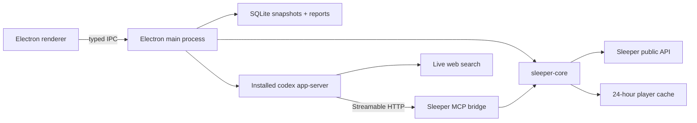

# Sleeper Caffeine

Sleeper Caffeine is an open-source, read-only fantasy football front office for the desktop. Connect a public Sleeper league, choose your roster, and use Codex to produce league-specific analysis grounded in live Sleeper data and current web research.

The first release is intentionally safe: it cannot change a lineup, submit a waiver claim, send a trade, or accept one.

## What works today

- Multi-league onboarding from a Sleeper league URL or ID.
- Team selection with Sleeper names, avatars, roster IDs, and user IDs.
- A polished dashboard, full roster room, reserve/taxi handling, headshots, and fallbacks.
- Manual Sleeper refresh with an immutable local snapshot history.
- A live draft board with completed picks, traded ownership, upcoming slots, and a deterministic candidate baseline.
- Board-bound Caffeine Plans with researched rankings, fallbacks, lifecycle states, and one coherent deep briefing.
- On-demand AI cards for team analysis and trade ideas.
- A persistent conversational analyst scoped to the active league.
- Live web research with an explicit distinction between search/discovery and cited sources.
- Waiver and weekly start/sit surfaces marked for activation when regular-season data is meaningful.
- A standalone Sleeper MCP server over stdio and an app-managed Streamable HTTP bridge.

## Product principles

1. **League data first.** Codex must read the Sleeper MCP before making league-specific claims.
2. **Refresh is deterministic.** Refreshing Sleeper updates SQLite and invalidates stale reports; it never spends an AI turn.
3. **AI is explicit.** Every report has its own Generate or Regenerate action.
4. **Search is not a source.** Search discovers material. Reports cite the page actually used.
5. **Read-only means read-only.** No Sleeper credentials, browser cookies, shell access, or hidden roster mutations.
6. **Local by default.** League snapshots, reports, recommendation history, chat, and the isolated Codex home live on the user's machine.

## Architecture



The renderer is sandboxed and receives only a narrow preload API. It never receives OpenAI tokens, raw child-process access, SQLite access, or arbitrary filesystem primitives.

Codex runs as one long-lived `codex app-server` process with:

- A dedicated `CODEX_HOME` inside the app's user-data directory.
- Codex-managed ChatGPT OAuth.
- A read-only sandbox and `approvalPolicy: "never"`.
- The shell tool disabled.
- Live web search enabled.
- The local Sleeper MCP configured automatically.

Sleeper Caffeine discovers Codex through `CODEX_CLI_PATH`, the user's `PATH`, or known Codex/ChatGPT application locations. It does not bundle a Codex binary.

## Repository layout

```text
apps/
  desktop/                 Electron + React desktop product
packages/
  sleeper-core/            Sleeper API, schemas, joins, cache, domain logic
  sleeper-mcp/             Standalone MCP plus stdio and HTTP transports
  ipc-contract/            Renderer/main schemas and typed API
  codex-runtime/           Binary discovery, JSONL RPC, OAuth, threads, turns
```

The desktop and MCP use the same `sleeper-core`; the UI never calls the MCP as an internal API.

The React renderer is organized around an internal design system and feature slices:

```text
renderer/
  app/            providers, query cache, runtime events, shell
  api/            sole typed preload/IPC client and data hooks
  components/ui/  reusable internal primitives and CSS Modules
  features/       onboarding, assistant, draft, reports, roster, settings
  styles/         semantic tokens, reset, and global Electron chrome
```

Canonical renderer state uses TanStack Query with explicit IPC mutations. Runtime events update or invalidate that cache; assistant-ui continues to own partial chat streaming. See [the renderer conventions](./apps/desktop/src/renderer/README.md) before adding a UI surface.

## Requirements

- Node.js 22 or newer.
- pnpm 10.
- An installed Codex CLI or an application that ships the Codex binary.
- A ChatGPT account for AI analysis. Sleeper browsing and roster views work without it.

## Run locally

```bash
pnpm install
pnpm dev
```

Production build:

```bash
pnpm build
pnpm --filter @sleeper-caffeine/desktop test:browser
pnpm --filter @sleeper-caffeine/desktop storybook:build
```

Package the current platform:

```bash
pnpm dist:mac
pnpm dist:linux
pnpm dist:win
```

The app is not yet signed or notarized. Local macOS builds may require the standard unsigned-app development workflow.

## Standalone Sleeper MCP

The original adapter remains independently usable:

```bash
pnpm build:packages
pnpm --filter @sleeper-caffeine/mcp start
```

Example Codex CLI registration:

```bash
codex mcp add sleeper -- node /absolute/path/to/sleeper-caffeine/packages/sleeper-mcp/dist/src/index.js
```

Tools:

| Tool                    | Purpose                                                        |
| ----------------------- | -------------------------------------------------------------- |
| `get_draft_snapshot`    | Live picks, traded ownership, board hash, and remaining picks. |
| `get_team_snapshot`     | Settings, joined roster, matchup, and traded-pick context.     |
| `get_available_players` | Players absent from every current league roster.               |
| `get_matchup_context`   | Both sides of a weekly matchup with joined players.            |
| `get_trade_context`     | Every roster, traded picks, drafts, and selected transactions. |
| `get_league_history`    | Linked historical seasons and obtainable champions.            |

Sleeper's player directory is cached for 24 hours. “Available” means absent from current rosters; it does not prove waiver clearance or lineup eligibility.

## Development checks

```bash
pnpm typecheck
pnpm lint
pnpm test
pnpm build
```

Read-only live checks are opt-in:

```bash
SLEEPER_LIVE_LEAGUE_ID=123456789012345678 \
SLEEPER_LIVE_USER=your_username \
pnpm test:live
```

The desktop also contains opt-in live coverage for onboarding and the Codex app-server handshake.

## Data and privacy

- Sleeper's documented fantasy API is public and read-only; no Sleeper password is requested.
- ChatGPT login is managed and stored by Codex inside the app-specific `CODEX_HOME`.
- OpenAI access and refresh tokens are never exposed to the renderer or stored in SQLite.
- “Clear local league data” removes leagues, snapshots, reports, chats, thread references, and the player cache. It deliberately does not sign the user out of ChatGPT.
- The Athletic may appear in public search results, but this release does not automate a signed-in browser or bypass a subscription wall.

See [SECURITY.md](./SECURITY.md) for reporting and trust boundaries.

## Roadmap

- Regular-season waiver and start/sit intelligence.
- Optional short-interval live-draft polling while the room is open.
- Recommendation outcomes and retrospective scoring.
- Additional projections/rankings adapters with clear licensing boundaries.
- Cross-platform release signing and auto-update infrastructure.
- Any future Sleeper write automation only as a separately designed, opt-in capability with explicit confirmations.

## Contributing

Issues and pull requests are welcome. Start with [CONTRIBUTING.md](./CONTRIBUTING.md), and keep every proposed Sleeper integration read-only unless a future design document explicitly changes that boundary.

## Sources

- [Sleeper API documentation](https://docs.sleeper.com/)
- [Model Context Protocol TypeScript SDK](https://github.com/modelcontextprotocol/typescript-sdk)
- [OpenAI Codex app-server documentation](https://developers.openai.com/codex/app-server)

## License

[MIT](./LICENSE)
